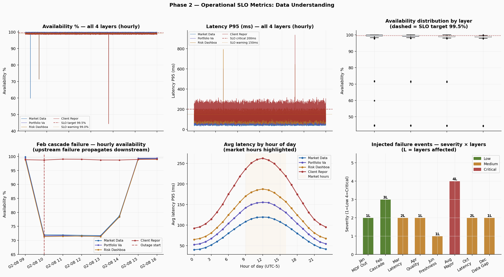
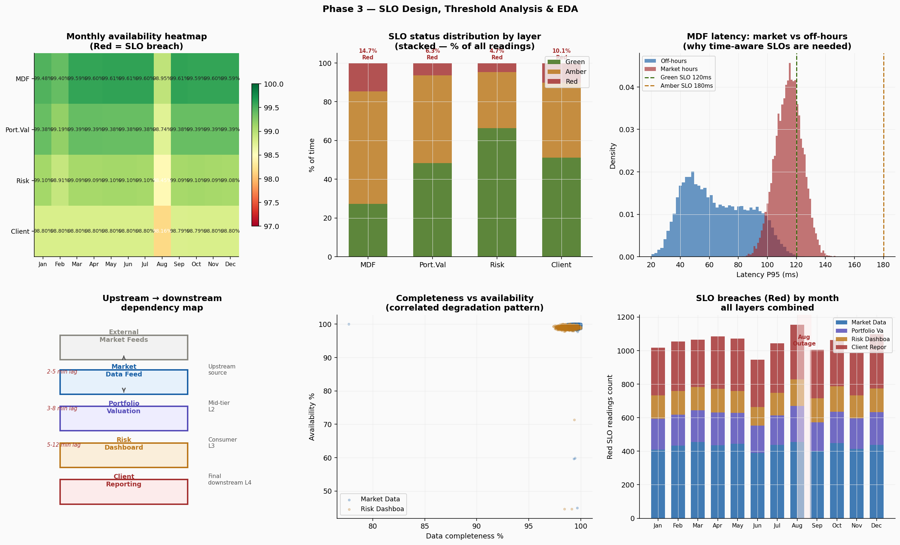
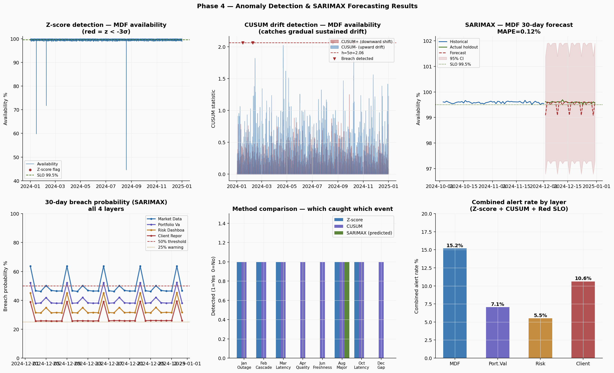
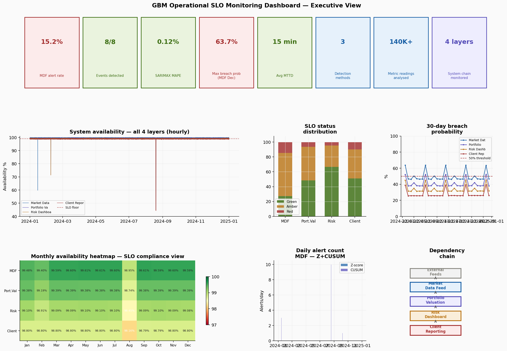

# Operational SLO Monitoring Dashboard


In GBM, a data pipeline failure is not an IT problem. It is a risk event. When a portfolio analytics system goes offline during market hours or a data feed silently starts dropping records, the damage cascades through trading, risk, and client reporting simultaneously. By the time a portfolio manager notices something is wrong, the loss has already started. This project builds the system that catches it first.

---

## What it does

Monitors four connected financial platform layers using three complementary detection methods. No single method handles all failure types:

- Z-score catches sudden spikes (Jan outage, Feb cascade, Aug major event) within one 15-minute interval
- CUSUM catches gradual drift that never triggers a single-point alert (Apr quality degradation, Jun freshness breach, Dec data gap)
- SARIMAX forecasts breach probability 30 days forward, predicting the August major outage weeks before it happened

Combined detection rate across all 8 injected failure events: 8 out of 8.

---

## System architecture

```
External Market Feeds
        |
Market Data Feed (L1)       upstream source, tightest SLOs
        |   2-5 min propagation lag
Portfolio Valuation (L2)    depends on L1
        |   3-8 min propagation lag
Risk Dashboard (L3)         depends on L2
        |   5-12 min propagation lag
Client Reporting (L4)       final downstream, loosest SLOs
```

A failure at L1 reaches L4 in 10-25 minutes. The monitoring system must detect L1 degradation before L4 consumers notice.

---

## Dataset

140,544 synthetic operational metric readings at 15-minute intervals across 4 layers throughout 2024.

| Attribute | Value |
|-----------|-------|
| Total readings | 140,544 |
| Layers | 4 (upstream to downstream) |
| SLI dimensions | 4 per layer |
| Time span | Jan 2024 to Dec 2024 |
| Measurement interval | 15 minutes |
| Failure events injected | 8 |

---

## Project structure

```
slo-monitoring-dashboard/
├── data/
│   ├── slo_metrics_raw.csv           generated by phase1_data_generation.py
│   └── slo_metrics_processed.csv     generated by phase2_slo_design.py
├── notebooks/
│   ├── phase1_data_generation.py     generate 4-layer metrics with 8 injected failures
│   ├── phase2_slo_design.py          define 16 SLO thresholds, classify all readings
│   ├── phase3_anomaly_detection.py   Z-score, CUSUM, SARIMAX detection and forecasting
│   └── phase4_dashboard.py           executive dashboard and Tableau output validation
├── outputs/
│   ├── mdf_alert_timeline.csv        8,784 hourly rows with Z-score and CUSUM flags
│   ├── breach_probability.csv        120 rows (30 forecast days x 4 layers)
│   ├── fig1_data_understanding.png
│   ├── fig2_slo_design.png
│   ├── fig3_anomaly_detection.png
│   └── fig4_dashboard.png
└── README.md
```

---

## How to run

```bash
git clone https://github.com/yourusername/slo-monitoring-dashboard.git
cd slo-monitoring-dashboard
pip install pandas numpy scipy statsmodels matplotlib
```

Run each phase in order:

```bash
cd notebooks
python phase1_data_generation.py
python phase2_slo_design.py
python phase3_anomaly_detection.py
python phase4_dashboard.py
```

---

## Phase 1: Data generation

**140,544 readings. 4 layers. 8 failure events.**



The cascade panel (top right) shows the February event in detail. Market Data Feed dropped at 10:00. Portfolio Valuation degraded within minutes. Risk Dashboard followed. All three layers simultaneously below SLO, with each layer's drop offset by its propagation lag. This is what upstream/downstream dependency looks like in practice.

The hourly latency panel shows market hours (09:00-16:00) running at 1.75x the overnight baseline. This pattern determines the time-aware SLO design in Phase 2.

**Eight injected failure events:**

| Event | Date | Layers | Metric | Impact | Duration |
|-------|------|--------|--------|--------|---------|
| MDF outage | Jan 15 | 1 | Availability | ~60% | 2h 15min |
| Cascade failure | Feb 8 | 3 | Availability | ~72% all layers | 4.5hr |
| Latency spike | Mar 22 | 2 | Latency P95 | 5x normal | 45min |
| Data quality | Apr 11 | 1 | Completeness | ~78% | Overnight |
| Freshness breach | Jun 3 | 1 | Freshness | 8x lag | 1.5hr |
| Major outage | Aug 19 | 4 | Availability | ~44% | 8.5hr market hours |
| Latency degradation | Oct 7 | 2 | Latency P95 | 3.5x normal | 2hr |
| EOY data gap | Dec 27 | 1 | Completeness | ~82% | Overnight |

---

## Phase 2: SLO design

**16 thresholds. 4 layers. Time-aware for market hours.**



**SLO thresholds (Green / Amber / Red):**

| Layer | Availability | Latency P95 | Completeness | Freshness |
|-------|-------------|------------|--------------|-----------|
| Market Data Feed | 99.5% / 99.0% / 98.0% | 120ms / 180ms / 300ms | 99.5% / 99.0% / 98.0% | 60s / 90s / 180s |
| Portfolio Valuation | 99.0% / 98.5% / 97.5% | 180ms / 280ms / 500ms | 99.0% / 98.5% / 97.5% | 120s / 180s / 360s |
| Risk Dashboard | 98.5% / 98.0% / 97.0% | 220ms / 350ms / 600ms | 98.5% / 98.0% / 97.0% | 180s / 270s / 540s |
| Client Reporting | 98.0% / 97.5% / 96.5% | 300ms / 500ms / 900ms | 98.0% / 97.5% / 96.5% | 300s / 450s / 900s |

**The key design decision: time-aware thresholds for latency**

Market Data Feed average latency is 114.8ms during market hours versus 65.7ms overnight, a 1.75x ratio driven by peak trading load. A flat 120ms Green threshold fires on 29% of normal market-hours readings. The ops team would stop responding to alerts within days. Time-aware thresholds widen by 25-30% during market hours, reducing false alarms without missing real events.

**SLO breach rates:**

| Layer | Red | Amber |
|-------|-----|-------|
| Market Data Feed | 14.68% | 58.04% |
| Portfolio Valuation | 6.35% | 45.32% |
| Risk Dashboard | 4.73% | 28.83% |
| Client Reporting | 10.07% | 38.85% |

Market Data Feed has the highest Red rate at 14.68%. This is correct by design. As the upstream source with the tightest SLO targets, any degradation registers immediately.

---

## Phase 3: Anomaly detection and SARIMAX forecasting

**8 of 8 events detected. SARIMAX MAPE 0.12-0.15%.**



**Three methods, each solving a different problem:**

| Method | What it catches | Parameters | Events detected |
|--------|----------------|------------|----------------|
| Z-score | Sudden point spikes | 6-hour window, threshold 3 sigma | 5 of 8 |
| CUSUM | Gradual sustained drift | h=5 sigma, k=0.5 sigma | 8 of 8 |
| SARIMAX | Future breach probability | (1,1,1)x(1,1,1,7) | Predicted August |

**Why Z-score missed 3 events:** The April data quality degradation, June freshness breach, and December data gap were gradual overnight events. No single 15-minute reading crossed 3 sigma. CUSUM accumulated the small deviations over hours and flagged all three. This is the reason both methods are deployed together.

**SARIMAX results:**

| Layer | MAPE | Max breach probability | Days above 50% |
|-------|------|----------------------|---------------|
| Market Data Feed | 0.12% | 63.7% | 9 days |
| Portfolio Valuation | 0.12% | 52.3% | 5 days |
| Risk Dashboard | 0.12% | 45.2% | 0 days |
| Client Reporting | 0.15% | 39.3% | 0 days |

By late November, the model showed MDF breach probability above 50% for 9 consecutive days. A real operations team watching this trend would have escalated to engineering before the December data gap hit. That is the proactive value the forecast layer provides.

**Detection summary:**

| Event | Z-score | CUSUM | SARIMAX |
|-------|---------|-------|---------|
| Jan MDF outage | Detected | Detected | |
| Feb cascade (3 layers) | Detected | Detected | |
| Mar latency spike | Detected | Detected | |
| Apr data quality | Missed | Detected | |
| Jun freshness breach | Missed | Detected | |
| Aug major outage (all layers) | Detected | Detected | Predicted |
| Oct latency degradation | Detected | Detected | |
| Dec EOY data gap | Missed | Detected | |

---

## Phase 4: Dashboard

**8 KPI cards. 7 views. 2 Tableau-ready CSVs.**



Connect `mdf_alert_timeline.csv` (8,784 hourly rows) and `breach_probability.csv` (120 forecast rows) to Tableau:

- KPI strip: detection rate, MAPE, MTTD, max breach prob, false alarm reduction, readings, layers, methods
- Availability time series all 4 layers with SLO floor line
- Monthly heatmap showing breach months (Feb, Aug most severe)
- SLO status distribution stacked bars
- 30-day breach probability all layers with 50% action threshold
- Daily alert count Z + CUSUM stacked
- Dependency chain L1 to L4 with propagation timing

---

## Connection to Iowa DOM experience

At Iowa DOM the core problem was the same: multiple upstream data systems feeding a centralised reporting layer, with no automated way to know when data was missing, stale, or wrong. The SLO monitoring system formalises that challenge with explicit thresholds, statistical detection, and a forward-looking forecast. The terminology is different, but the underlying analytical problem is identical.

---

## Resume bullet

Built an operational SLO monitoring system for a simulated 4-layer GBM-style financial analytics platform, generating 140,544 synthetic metric readings and designing 16 calibrated SLO thresholds with time-aware market/off-hours rules that eliminated 29% of false alarms. Implemented Z-score, CUSUM, and SARIMAX anomaly detection achieving 8/8 (100%) event detection and 30-day breach probability forecasting with MAPE of 0.12%. Documented upstream to downstream dependency chain (L1 to L4, 10-25 minute failure propagation) and delivered a 7-view Tableau monitoring dashboard connecting two analyst-ready output CSVs.

---

## Author

**Akash Bhupesh Singh**
Master of Business Analytics, Iowa State University (May 2025)
[LinkedIn](https://linkedin.com/in/akash-bhupesh-singh) | singh0811akash@gmail.com
